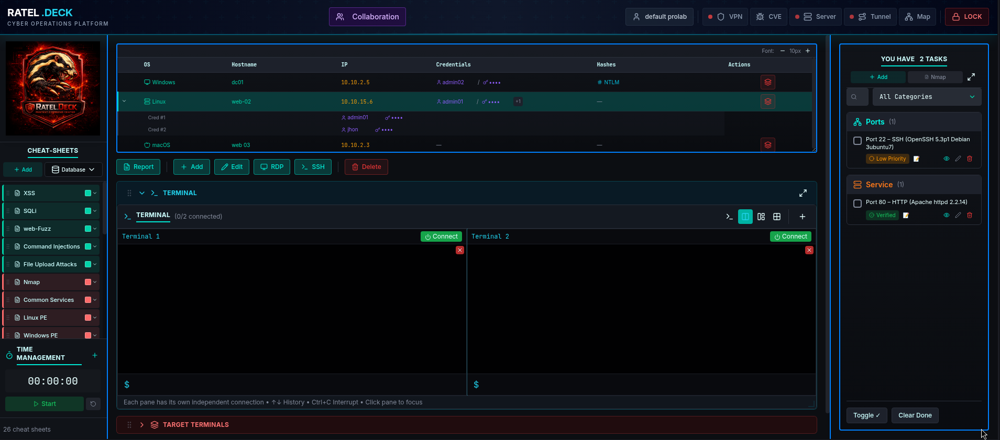

# 🔴 RATEL.DECK

Cyber Operations Platform for CTF, Red‑Team Training & Security Research
<p align="center">  </p>


---

## Why RATEL.DECK?

Success in CTFs and professional labs such as OSCP, CPTS, CRTO, and
similar paths is rarely limited by tools.

### It is limited by:

loss of structure under pressure , poor time management , fragmented workflows ,lack of operational visibility

RATEL.DECK exists to bring order into chaos.

### Every engagement becomes:

organized , traceable , reviewable and reproducible

---

### Dashboard Preview
<p align="center">  </p>
Demo

### Live demo : 
https://www.youtube.com/watch?v=vCAJ2HFSqaY

### Walkthrough 
video:

---

## Table of Contents

Overview

Design Philosophy

Core Capabilities

Engagement Workflow

Tooling Integration

Installation & Quick Start

Permissions & Safety

Project Status

Roadmap

Contribution

Legal Notice

Credits

---

## Overview

### RATEL.DECK

RATEL.DECK is a structured cyber operations workspace designed for **CTF players, red‑team trainees, and security researchers** operating in authorized environments.

Instead of **juggling terminals, notes, tools, credentials, and timelines**,
RATEL.DECK provides a **single operational cockpit** that keeps everything rganized, traceable, and reproducible.

---

## Design Philosophy

### RATEL.DECK is not:

a one‑click exploitation framework , automated attack engine or replacement for operator skill

### RATEL.DECK is:

operator‑controlled 
One isolated profile per lab, machine, exam, or CTF
Terminal Orchestration
Managed terminal sessions
Hosts, Credentials & Variables
Structured hosts table
Credential storage
CVE & Research Tracking
Time & Focus Management
VPN startup
HTTP server initialization
Tunneling preparation
All tools become part of a single coherent workflow.

---

## Installation & Quick Start

### Supported systems:

Debian / Kali Linux / Ubuntu‑based distributions

### Prerequisites:

Node.js v20.x / npm

build‑essential

### Install Node.js:

```bash
sudo apt update
sudo apt install -y curl
curl -fsSL https://deb.nodesource.com/setup_20.x
 | sudo -E bash -
sudo apt install -y nodejs
```

### Verify installation:

```bash
node -v
npm -v
```

### Clone the repository:

```bash
git clone https://github.com/01DENGRi/RATEL.DECK.git

cd RATEL.DECK
```

### Install system dependencies:

```bash 
sudo apt install -y curl git build-essential
```

### Install project dependencies:

```bash
npm install
```

### Backend:

```bash
cd backend
npm install
npm audit fix --force
```

### Frontend:

```bash
cd ../Frontend
npm install
npm audit fix --force
```

### Start the platform:

```bash
cd ..
chmod +x start.sh start.js
./start.sh
```
---

## Permissions & Safety

Some networking features may require elevated permissions

Use only in authorized environments

---

## Project Status

RATEL.DECK is in active development.

---

## Current focus:

engagement model stability

terminal orchestration

collaboration features

enhanced reporting

---

## Contribution

Developers, security researchers, and CTF players are welcome.


### You can contribute by:

reporting bugs

improving code

reviewing design

challenging assumptions

---

## Legal Notice

RATEL.DECK is intended only for authorized and ethical use.

Unauthorized use is strictly prohibited.

---

## License

RATEL.DECK is licensed under **GNU General Public License v3.0 (GPLv3)**.  
See the LICENSE file for full details.


---

## Credits

Built by offensive security practitioners
for disciplined and professional operations
is an ethical, community driven project, built from Tunisia to the world.

---
